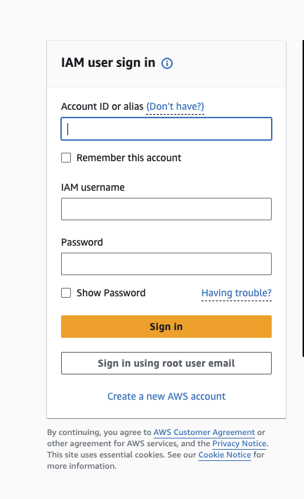
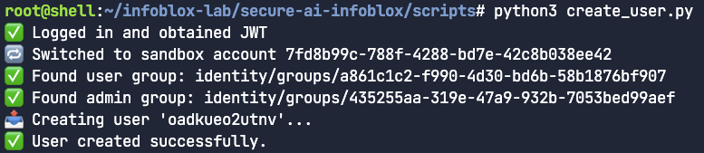
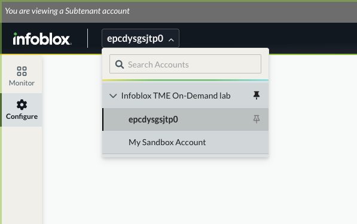
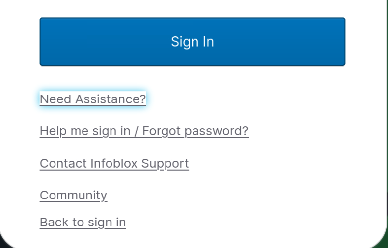

In this lab, you will get hands-on with Infoblox Universal DNS Management, a single solution for
visibility and control of DNS tools used across on-premises, hybrid, and multi-cloud networks. You will
begin with a tour of the centralized visibility and management for DNS, exploring the efficiency of the
consolidated Infoblox Portal. Then, you’ll manage DNS records in Azure DNS and AWS Route 53, using
the same Universal DDI interface and workflow to make updates across clouds.


> [!IMPORTANT]
> **NOTE:** This environment is *real*! AWS and Azure Cloud Accounts have been created for each student. No bitcoin mining, please! :)

In this section we will:
1) Review the cloud architecture
2) Login to your cloud account console's
3) Deploy resources onto your cloud regions
4) Create your Infoblox Portal user

---

## 1) Review Cloud Architecture
===

First lets review the cloud architecture that has been provisioned for your Infoblox Lab experience.

Navigate to the *Lab Diagram* tab above and review the diagram. This is what we're building today!


## 2) Login to your cloud account consoles
===

🔐 Logging In to the AWS Console

👉 First, open the “AWS Console” tab on the left-hand side of your Instruqt lab environment. This will launch the AWS login page in a new browser panel.



Then follow these steps:
1.	Select “IAM Account”
On the login screen, choose IAM Account (not root).


2.	Enter the AWS Account ID, AWS IAM username, and password by copying and pasting the values from the section below.

📝 Note: Avoid the root account login — this lab is configured for IAM users only.

---
# AWS Credentials ☁️

**AWS Account ID**
```
[[ Instruqt-Var key="INSTRUQT_AWS_ACCOUNT_INFOBLOX_DEMO_ACCOUNT_ID" hostname="shell" ]]
```

**AWS Username**
```
[[ Instruqt-Var key="INSTRUQT_AWS_ACCOUNT_INFOBLOX_DEMO_USERNAME" hostname="shell" ]]
```

**AWS Password**
```
[[ Instruqt-Var key="INSTRUQT_AWS_ACCOUNT_INFOBLOX_DEMO_PASSWORD" hostname="shell" ]]
```

---

# AZURE Credentials ☁️

👉 Open the Instruqt tab on the left labeled “AZURE Console”
This will launch the Azure login page directly inside your sandbox environment.

⸻

🧭 Step-by-Step Instructions


1.	Click “Sign In”
On the landing page (as shown in the screenshot), click the “Sign in” button at the top right or in the black banner.
2.	Enter Credentials
Use the Azure username and password provided under **AZURE CREDENTIALS**.
3.	Skip the Microsoft Onboarding Tour
If prompted with a “Get Started with Azure” setup wizard or tour:
•	Click “Skip”, “Maybe later”, or “Dismiss”
•	Do not start a free trial or create new subscriptions
•	You are already working in a pre-provisioned lab environment
4.	Ready to Go
Once logged in, use the top search bar to navigate to services like:
•	Virtual Network
•	Private DNS Zones
•	Resource groups

AZURE CREDENTIALS

---

**AZURE SUBSCRIPTION**
```
[[ Instruqt-Var key="INSTRUQT_AZURE_SUBSCRIPTION_INFOBLOX_TENANT_SUBSCRIPTION_ID" hostname="shell" ]]
```

**AZURE Username**
```
[[ Instruqt-Var key="INSTRUQT_AZURE_SUBSCRIPTION_INFOBLOX_TENANT_USERNAME" hostname="shell" ]]
```

**AZURE Password**
```
[[ Instruqt-Var key="INSTRUQT_AZURE_SUBSCRIPTION_INFOBLOX_TENANT_PASSWORD" hostname="shell" ]]
```


## 3) Deploy resources onto your cloud regions
===

🧱 Deploying the Lab Infrastructure

Now that you’ve logged into both cloud consoles, it’s time to deploy the infrastructure that reflects the architecture shown in the lab diagram.

👉 Switch back to the “>_ Shell” tab in the left-side panel of your Instruqt lab to proceed.

### 1. Deploy AWS resources in EU

⚙️ Pre-deployed Infrastructure(AWS)

To save time and avoid long waits during the lab, core resources have already been provisioned in the background using Terraform. You don’t need to deploy everything from scratch.

You can verify this pre-deployment in two ways:

•	🔍 AWS Console – Navigate to the relevant services (EC2, VPC, TGW, etc.) and confirm that the resources are already in place according to the LAB Diagram.

•	🧾 Terraform Output – Run terraform output in the repo directory to view key variables and resource info like instance IPs, VPC IDs, etc.

```run
cd ~/infoblox-lab/Infoblox-PoC/terraform
terraform output
```

If you’re curious, the actual Terraform code used is available in the **Editor** window of this lab. Feel free to explore it and see how each resource is defined and managed.

Set up the DNS infrastructure with the appropriate VPC associations and A-records as outlined in the lab diagram.

```run
cd ~/infoblox-lab/Infoblox-PoC/terraform
terraform apply --auto-approve -target=aws_route53_zone.private_zone -target=aws_route53_record.dns_records
```

### 2. Deploy Azure resources in North Europe

⚙️ Pre-deployed Infrastructure (Azure)

To speed up the lab and avoid unnecessary provisioning time, the core Azure resources have already been deployed in advance using Terraform.

You can validate this pre-provisioned state in two simple ways:

•	🔍 Azure Portal – Head to the Resource Group where this lab is deployed and inspect VMs, VNets, subnets, etc. according to the LAB Diagram.

•	🧾 Terraform Output – Run terraform output in the working directory to get useful details like IP addresses, VNet names, and other variables used in the lab.

```run
cd ~/infoblox-lab/Infoblox-PoC/terraform
terraform output
```

Want to see how it all works? The Terraform code is fully visible in the **Editor** window, so feel free to poke around and understand the architecture.

Set up the DNS infrastructure with the appropriate Vnet associations and A-records as outlined in the lab diagram.


```run
cd ~/infoblox-lab/Infoblox-PoC/terraform
terraform apply --auto-approve -target=azurerm_private_dns_zone.private_dns_azone -target=azurerm_private_dns_zone_virtual_network_link.eu_vnet_links -target=azurerm_private_dns_a_record.eu_dns_records
```


## 4) Create Admin User to your Infoblox Portal Dashboard
===

# Pre-Step: User Creation

There are two different flows depending on whether you are running this lab On-Demand or as part of a Live Event (Hot Pool). Please follow the correct path below.


##  ▶️ Live Event (Hot Pool)

> [!IMPORTANT]
Live Event Only: If you are running this lab as part of a live event (Hot Pool), you must manually create your user before continuing.
For On-Demand labs, your user is already created automatically — you can skip this step and go directly to On-Demand Section 1.

1.	In the Instruqt Shell tab, export your business email as an environment variable:


```
echo 'export INSTRUQT_EMAIL="your.business.email@example.com"' >> ~/.bashrc
source ~/.bashrc
```

⚠️ Make sure to use the same business email you registered with for this event and the one you used to start the lab.

2.	Run the user creation script:

```run
cd  /root/infoblox-lab/Infoblox-PoC/scripts
python3 create_user.py
```

3.	Once the script completes successfully, proceed with the steps described in Section 1 below.




> [!NOTE]
> Note: Use your Business Email for User Creation


## ▶️ On-Demand Lab

Your user account and sandbox tenant have already been created. The next step is to input your password and activate your account.

> [!IMPORTANT]
> If you’ve never accessed the Infoblox Portal before using the email address you used to start this lab, please follow the steps outlined below in Section 1 to activate your account.
However, if you’ve previously engaged with the Infoblox Portal using the same email, your account is likely already active and associated with the correct tenant. In that case, you can skip Section 1, and optionally skip Section 2, unless you’ve forgotten your password and need to reset it.

### Section 1

1. Please check the inbox of the email account you used to register for the Infoblox Lab.
2. You will receive an email with the subject “Infoblox User Account Activation”. Open this email and click on the “Activate Account” button to proceed.


3. A new browser window or tab will open, prompting you to create a new password. Please enter your desired password to complete the setup.


4. Once you’ve set your password, close the newly opened tab or window. We’ll be logging in through the Instruqt tab labeled "Infoblox Portal".
5. In the Instruqt tab labeled "Infoblox Portal", log in using the credentials you set up in the previous steps.
6. After logging in, please mark the first window as shown in the example below. This confirms that you have successfully accessed the Infoblox Portal.


7. In the upper-left corner of the Infoblox Portal, click on the drop-down menu. Use the “Find Account” field to search for your sandbox by entering the "Sandbox-ID" shown below. It is important that you select your specific Sandbox-ID from the list and click on it to proceed.

**Your Sandbox ID**
```
[[ Instruqt-Var key="Sandbox_ID" hostname="shell" ]]
```

---




---

### Section 2 ⚠️ (Troubleshooting) Help! I Forgot My Password


✅ Existing User

1.	Go to Infoblox Portal tab on the left.
2.	Log in using your existing email address and password.
3.	Once authenticated, the lab tenant will be automatically added to your list of available tenants (you’ll see it in the top-right tenant switcher).


In order to RESET the password follow the steps below:

1. Please navigate to the Infoblox Portal page by clicking on the Infoblox Portal tab within the Instruqt lab environment. This will direct you to the appropriate login interface.
2. Once you’re on the Infoblox Portal page, click on “Need Assistance” located at the bottom of the login form.


3. After clicking on “Need Assistance”, select “Forgot Password” from the available options to initiate the password reset process.



4. You will receive an email with the subject “Account Password Reset.” Open this email and click on the “Reset Password” button to proceed with setting a new password.


5. Once you’ve set up your password, please return to "Section 1" of the instructions and continue from Step 4 onward.


## Time for the Next Challenge

Now we've inspected the playing field its game time. Click **NEXT**!
