🌐 Universal DDI Management™: The Backbone of Modern Network Services

Universal DDI Management™ is the industry’s first and most comprehensive SaaS-based solution for managing critical DNS, DHCP, and IPAM services across hybrid and multicloud environments. Think of it as your cloud-native command center for everything DDI.


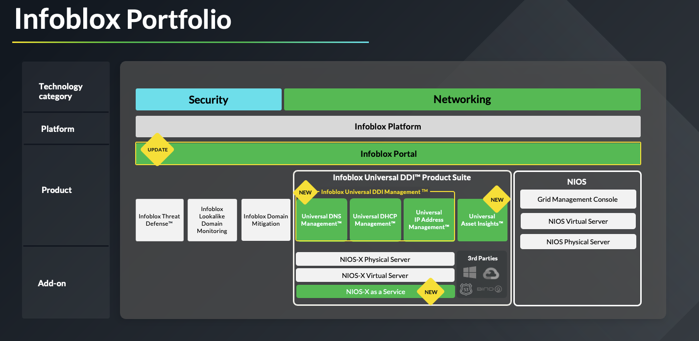

🔧 What It Does

•	Central Hub

Provides a single SaaS control plane to configure and manage all your network services—whether they’re on-prem, in AWS, Azure, GCP, or anywhere else.

•	Comprehensive Consolidation

Unifies DNS, DHCP, and IP address management across:

•	Microsoft DNS - coming soon

•	BIND - coming soon

•	Infoblox NIOS and NIOS-X

•	Amazon Route 53

•	Azure DNS

•	Google Cloud DNS

•	Streamlined Operation

Speeds up service delivery by eliminating silos and unifying policy and configuration across the infrastructure.


⸻


💡 Four Core Value Points

1.	🧭 Centralized Control

A single interface to configure, monitor, and manage DNS/DHCP/IPAM across any environment.

2.	🔌 Deep Integration

Bridges traditional DNS (like Microsoft and BIND) with modern cloud-native DNS platforms.

3.	⚙️ Operational Efficiency

Reduces management overhead, accelerates change delivery, and improves troubleshooting and governance.

4.	📈 Scalability and Flexibility

Whether you’re running bare metal, virtual appliances, or SaaS-native DNS like NIOS-X, it scales with your architecture.

# Infoblox UDDI Portal as a Single Pane of Glass


The Infoblox Portal can be configured to manage DNS and IPAM data from public cloud providers like AWS, Azure, and GCP.

Complete the following steps to sync DNS  data from AWS and Azure.

## 1) Login to your cloud account consoles
===

🔐 (Optional) Log in to Your Cloud Account Consoles

You should already be signed in to both the AWS and Azure web consoles via the embedded tabs on the left-hand side of the Instruqt interface.

⚠️ Only perform this step if you’re logged out or the session has expired.

- Use the credentials provided in the lab instructions to sign in.
- Skip any onboarding wizards or tutorials (especially on Azure).
- If prompted for account type on AWS, select IAM Account.

---

---
# AWS Credentials ☁️

Select "IAM Account" and enter the **AWS ID**:
```
[[ Instruqt-Var key="INSTRUQT_AWS_ACCOUNT_INFOBLOX_DEMO_ACCOUNT_ID" hostname="shell" ]]
```

**AWS Username**
```
[[ Instruqt-Var key="INSTRUQT_AWS_ACCOUNT_INFOBLOX_DEMO_USERNAME" hostname="shell" ]]
```

**AWS Password**
```
[[ Instruqt-Var key="INSTRUQT_AWS_ACCOUNT_INFOBLOX_DEMO_PASSWORD" hostname="shell" ]]
```

---

# AZURE Credentials ☁️

**AZURE SUBSCRIPTION**
```
[[ Instruqt-Var key="INSTRUQT_AZURE_SUBSCRIPTION_INFOBLOX_TENANT_SUBSCRIPTION_ID" hostname="shell" ]]
```

**AZURE Username**
```
[[ Instruqt-Var key="INSTRUQT_AZURE_SUBSCRIPTION_INFOBLOX_TENANT_USERNAME" hostname="shell" ]]
```

**AZURE Password**
```
[[ Instruqt-Var key="INSTRUQT_AZURE_SUBSCRIPTION_INFOBLOX_TENANT_PASSWORD" hostname="shell" ]]
```

## ☁️ Cloud Discovery Overview (AWS & Azure)
===

**Infoblox Universal Asset Insights** automatically discovers and tracks cloud resources using native cloud APIs.

This reduces manual overhead, keeps your inventory fresh, and enables deeper asset visibility across your multicloud environment.

⸻

🔹 AWS Discovery


Infoblox connects to AWS via a cross-account IAM role, which the platform assumes using a secure External ID. The following resources are discovered:

- EC2 instances, VPCs, subnets
- Route tables, NAT and Internet Gateways
- Load Balancers (ALB, NLB)
- Route 53 Hosted Zones and Records (with optional write access)
- Tags, regions, and metadat


As part of the cloud discovery integration, Infoblox uses an IAM role named infoblox_discovery to securely access your AWS environment. This role defines the permissions Infoblox uses during synchronization jobs, such as reading resource metadata or managing DNS records (if enabled).

The role is assumed using a secure ExternalId, which ensures that only Infoblox can use it — even if the role ARN is exposed. This is a best practice for cross-account access with third-party integrations.

The screenshot below illustrates what a properly configured IAM role  looks like in the AWS Console (for the LAB environment):


⸻

🔹 Azure Discovery

Infoblox connects to Azure using a service principal (App registration) with a custom or built-in role assignment at the subscription or resource group level. Discovered resources include:

- Virtual Machines and associated NICs
- Virtual Networks (VNets), subnets, peerings
- Network Security Groups, DNS zones and records
- Resource groups, tags, and regional metadata

⸻

🔐 Azure Permissions Required for Universal DDI


✅ Minimum Roles Required


- Reader:

Grants read-only visibility into Azure resources.

Used for IPAM sync, asset discovery, and general inventory collection.

✅ Safe default for read-only discovery.

NOTE: For more information, see [Reader role](https://learn.microsoft.com/en-us/azure/role-based-access-control/built-in-roles/general#reader).

⸻

- DNS Zone Contributor:


Full management of public DNS zones and record sets.

❌ Does not grant access control (RBAC).

NOTE: For more information, see [DNS Contributor role](https://learn.microsoft.com/en-us/azure/role-based-access-control/built-in-roles#dns-zone-contributor)

⸻

- Private DNS Zone Contributor:

Same as above, but scoped to private DNS zones.

❌ Does not control virtual network links.

NOTE: For more information, see [Private DNS Zone Contributor](https://learn.microsoft.com/en-us/azure/role-based-access-control/built-in-roles#private-dns-zone-contributor).

⸻


⚙️ Resource Group Management


If your setup creates or manages resource groups, the following actions are required:

- Microsoft.Resources/subscriptions/resourceGroups/write
- Microsoft.Resources/subscriptions/resourceGroups/delete


📌 Used when the deployment dynamically creates resource groups for forwarders or discovery.


⸻

🧾 App Registration Prerequisites


To register an application (service principal), your Azure user must have the:

- Cloud Application Administrator role
- Fulfill [App Registration prerequisites](https://learn.microsoft.com/en-us/entra/identity-platform/quickstart-register-app#prerequisites)


⸻


🔍 Permissions Required for Cloud Forwarder Discovery Only


If you only need to read DNS Resolver config, the following permissions are sufficient:


```
- Microsoft.Network/dnsResolvers/read
- Microsoft.Network/dnsResolvers/inboundEndpoints/read
- Microsoft.Network/dnsResolvers/outboundEndpoints/read
- Microsoft.Network/dnsForwardingRulesets/read
- Microsoft.Network/dnsForwardingRulesets/forwardingRules/read
- Microsoft.Network/dnsForwardingRulesets/virtualNetworkLinks/read
```

⸻

## 2) Onboarding AWS account onto Infoblox Portal
===

Before integrating AWS Route 53 with Universal DDI, you must first define the type of AWS Route 53 deployment you are using. Defining the type of AWS Route 53 deployment is required since each type of deployment has different configuration parameters that will be used while configuring network discovery in Universal DDI.

We are going to use -> Account Preference: Auto-Discover Multiple (Recommended)/Type of Access: Principal ID + Role ARN

### Step-by-Step Guide: AWS Discovery Configuration via Infoblox Portal

#### 1. Retrieve Required Identifiers

To proceed with the AWS Discovery configuration, you will need the following information:
	•	Principal ID
	•	External ID

Ensure you have this information available before continuing.

#### 2. Access the Infoblox Portal
Navigate to the Infoblox Portal.
From the top navigation menu, go to:
Configure → Networking → Discovery.


#### 3. Configure AWS Discovery
1.	Within the Discovery section, select the Cloud tab.
2.	Click on Create AWS to begin setting up cloud discovery for AWS.

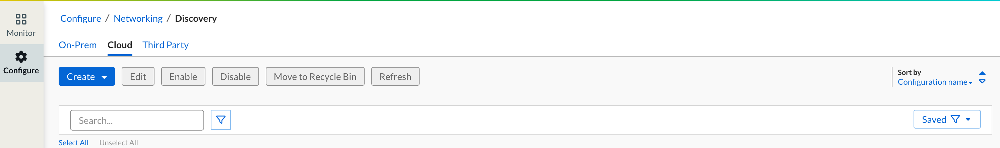


NOTE: Gather information from the portal about External ID and Principal ID.

#### 4. In the left-hand panel of your Instruqt lab, navigate to the **AWS Discovery** TAB and click “Deploy to AWS”.


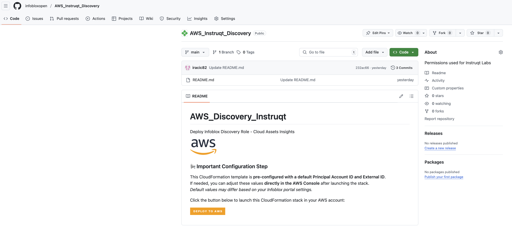


 > [!IMPORTANT]
> NOTE: This action will redirect you to the AWS Console login page.

#### 5. Authenticate using the AWS Console credentials provided earlier in **Section 1** of this guide.

#### 6.Upon successful login, you will be taken directly to the CloudFormation Stack creation page.

Refer to the screenshot below for reference.


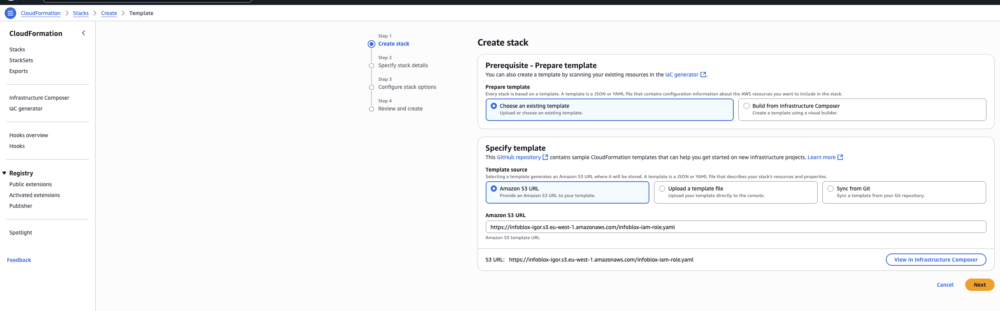


#### 7. Please click on NEXT

#### 8. Provide a name for the CloudFormation stack and enter the External ID captured in the previous steps.


> 	 > [!NOTE]
> Note: Leave the Account ID unchanged and COPY/PASTE External ID from the Infoblox Portal.


#### 9.Click "Next" on each page, keeping all settings at their default values.


#### 10.Click "Submit" on the next page

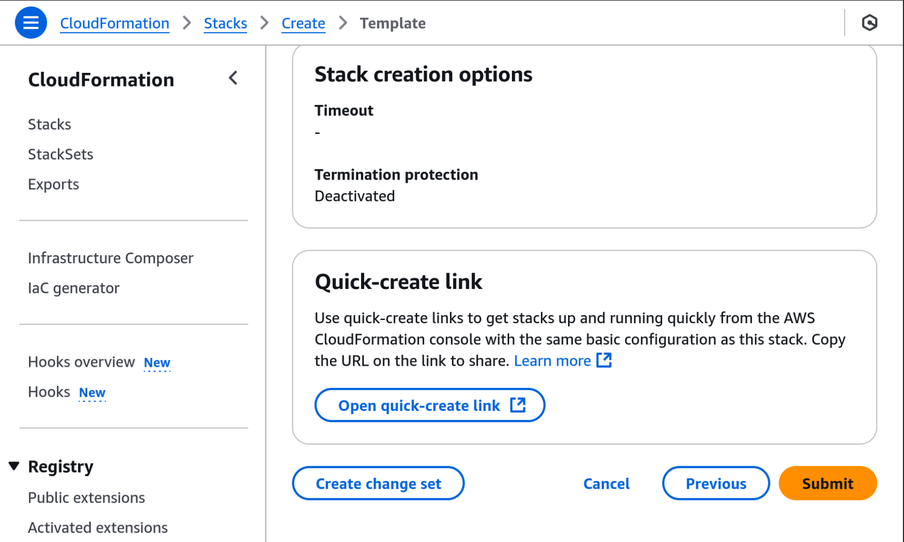


#### 11.Wait for the CloudFormation stack creation to complete, then navigate to the "Outputs" tab to retrieve the ARN value.

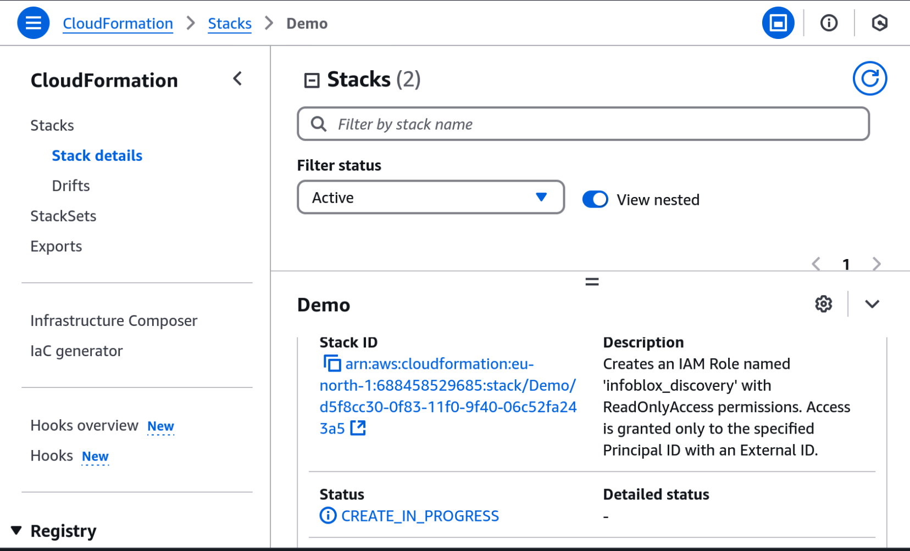

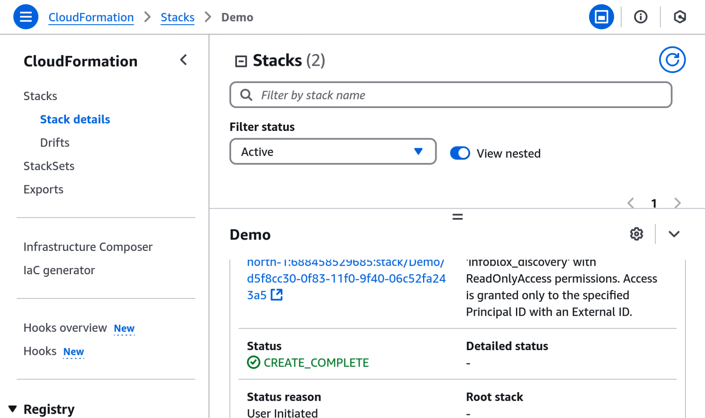

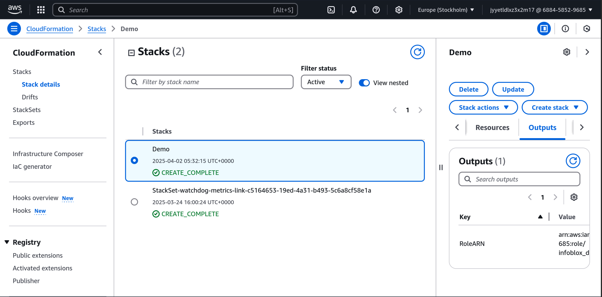


#### 12.Return to the Infoblox Portal where you initiated the AWS Discovery Job, paste the retrieved ARN value into the appropriate field, and click "Next" to proceed.


#### 13.On the next page, configure the settings to match those shown in the screenshot below, then click "Next" to continue.


#### 14.On the next page, configure the settings to match those shown in the screenshot below, then click "Next" to continue.


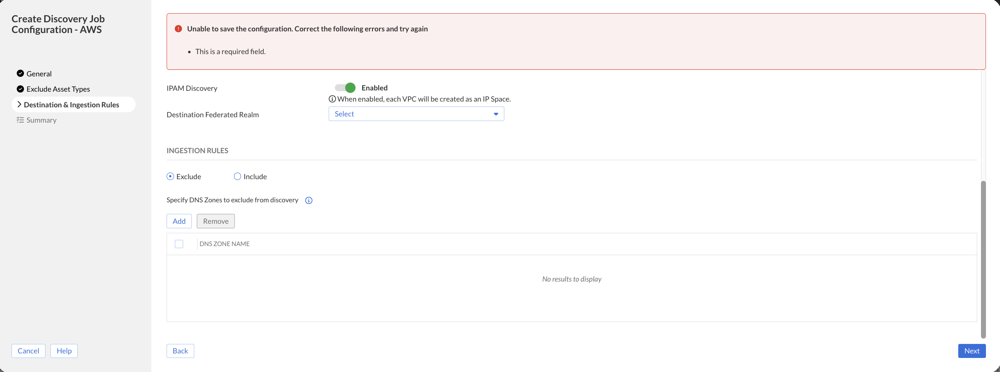


> [!IMPORTANT]
> ⚠️ Important Note: In this lab, we are creating a completely new DNS View during discovery. Because of this, the “Consolidate Public/Private Zone Data” toggle must remain disabled.

If you enable this toggle while creating a new view, the job will fail, since consolidation only works with an existing DNS View.

✅ As a result, you will see a new DNS view automatically created for private zones, typically labeled:

•	AWS.private-1

•	Azure.private-1

This is expected behavior when consolidation is not applied. These views are auto-generated by the platform to separate public and private zone data.

> [!IMPORTANT]
> 💡 Production Tip: It’s recommended to consolidate both public and private zones into a single DNS View in production environments. This simplifies DNS management, auditing, and policy enforcement.

#### 15.On the next page, configure the settings to match those shown in the screenshot below, then click "Save&Close" to continue.


## 3) Onboarding Azure account onto Infoblox Portal
===

Azure DNS is a cloud DNS web service that routes end users’ requests to internet applications and resources by resolving domain names into IP addresses and IP addresses into domain names. In Azure, DNS records are organized into hosted zones, which are configured through the Azure API, Azure CLI, or Azure Resource Manager.

Universal DDI provides the capability for synchronizing and integrating public-hosted zones with Azure, and this allows users to view and manage Azure DNS data through the Infoblox Portal. Also, BloxOne NIOS-X Servers can be configured to service zones synchronized from Azure.


The Infoblox Azure DNS integration feature offers the following:

Two-way synchronization of public-hosted zones and records between Azure and Universal DDI after the initial configuration and sync is complete. Synchronization of Azure DNS resource records configured with a simple routing policy is supported. Other routing policies are not supported. Synchronization of DNSSEC records is not supported.

One-way synchronization of private zones from Azure DNS to Universal DDI. The synchronized zones are read-only.

Viewing and management of Azure-NIOS-X hosted zones and records through the Infoblox Portal.

A NIOS-X Server can directly respond to DNS queries from clients for private zones that are managed in Azure. A NIOS-X Server can be configured as a secondary DNS server for local clients thereby reducing the network load since the queries do not need to recurse to Azure DNS.

### Step-by-Step Guide: AWS Discovery Configuration via Infoblox Portal

#### 1. Navigate to the Infoblox Portal and go to Configure → Administration → Credentials.


#### 2. Click Create and select Microsoft Azure from the dropdown menu.

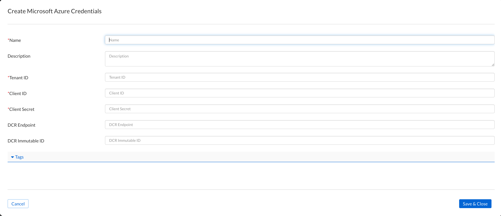


#### 3. Fill in all required fields marked with an asterisk (*) using the details provided below and click "Save&Close".

> [!IMPORTANT]
> NOTE: Please do not forget to give it a Name at the top.


**AZURE Tenant ID**
```
[[ Instruqt-Var key="INSTRUQT_AZURE_SUBSCRIPTION_INFOBLOX_TENANT_TENANT_ID" hostname="shell" ]]
```

**AZURE Client ID**
```
[[ Instruqt-Var key="INSTRUQT_AZURE_SUBSCRIPTION_INFOBLOX_TENANT_SPN_ID" hostname="shell" ]]
```

**AZURE Client Secret**
```
[[ Instruqt-Var key="INSTRUQT_AZURE_SUBSCRIPTION_INFOBLOX_TENANT_SPN_PASSWORD" hostname="shell" ]]
```


#### 4. Access the Infoblox Portal

1.	Navigate to the Infoblox Portal
2.	From the top navigation menu, go to:

Configure → Networking → Discovery.


#### 5. Configure Azure Discovery
1.	Within the Discovery section, select the Cloud tab.
2.	Click on Create Azure to begin setting up cloud discovery for Azure.


#### 6. Fill in all required fields marked with an asterisk (*) using the details provided below.

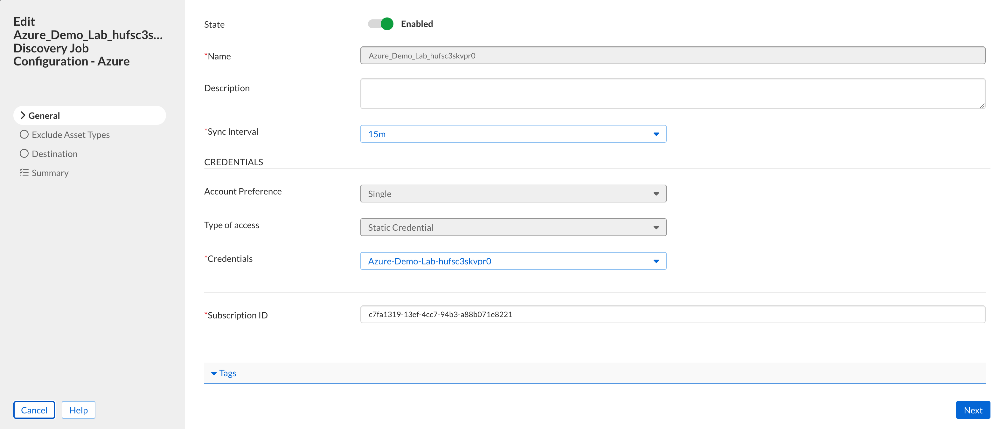

> [!IMPORTANT]
> Please give it a name and Select "Type of Access" -> Static ------->  under" Credentials" select the one you have created in the previous step.

Azure subscription id can be found below.

**AZURE SUBSCRIPTION ID**
```
[[ Instruqt-Var key="INSTRUQT_AZURE_SUBSCRIPTION_INFOBLOX_TENANT_SUBSCRIPTION_ID" hostname="shell" ]]
```

#### 7.On the next page, configure the settings to match those shown in the screenshot below, then click "Next" to continue.

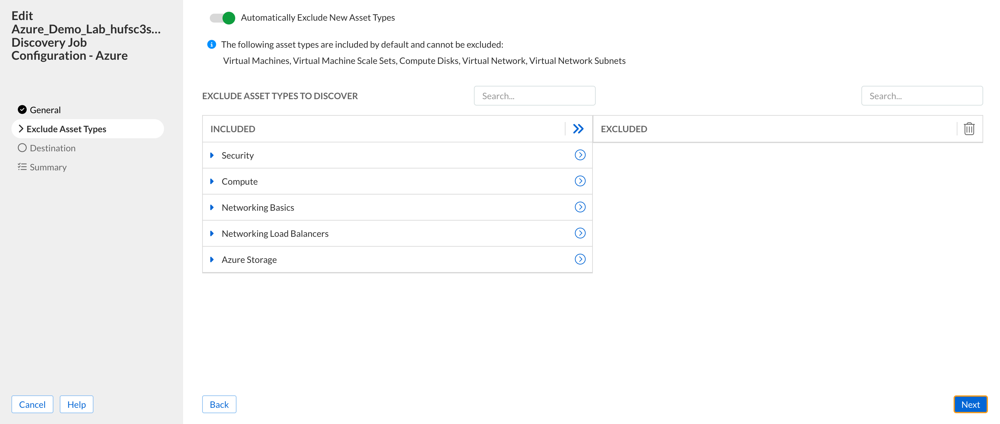

#### 8.On the next page, configure the settings to match those shown in the screenshot below, then click "Next" to continue.


> [!IMPORTANT]
> ⚠️ Important Note: In this lab, we are creating a completely new DNS View during discovery. Because of this, the “Consolidate Public/Private Zone Data” toggle must remain disabled.

If you enable this toggle while creating a new view, the job will fail, since consolidation only works with an existing DNS View.

✅ As a result, you will see a new DNS view automatically created for private zones, typically labeled:

•	AWS.private-1

•	Azure.private-1

This is expected behavior when consolidation is not applied. These views are auto-generated by the platform to separate public and private zone data.

> [!IMPORTANT]
> 💡 Production Tip: It’s recommended to consolidate both public and private zones into a single DNS View in production environments. This simplifies DNS management, auditing, and policy enforcement.

#### 9.On the next page, configure the settings to match those shown in the screenshot below, then click "Save&Close" to continue.


## 4) 🔍 UDDI Explore and Visibility of Assets
===


In this section, we validate the end-to-end visibility of assets and DNS data across cloud environments using Infoblox UDDI.

Open and login to Infoblox UDDI Portal.

✅ Step 1: Verify Discovery Sync

We navigate to Configure > Networking > Discovery to confirm that discovery jobs for both AWS and Azure are in a **Synced** state:

> [!IMPORTANT]
> NOTE: It will take around 2 x sync job interval ( 15mins each ) for the Discovery jobs to get synced.


🌐 Step 2: Explore AWS DNS Zones

Please login to the Infoblox Portal:

**Under Configure →Networking →DNS → Zones**, we explore the AWS-specific DNS view we have created in previous steps:

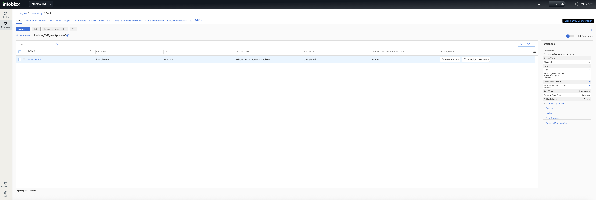

We validate the zone infolab.com has been successfully pulled from Route 53.
Confirmed record sync with A records like:


app1.infolab.com → 10.20.0.100

app2.infolab.com → 10.20.2.100

app3.infolab.com → 10.20.3.100


We then add a new record under →** Create/Record/A Record**:

app4.infolab.com → 10.10.10.9


Please add the record following the information from the screenshot below:


After saving, we switch to AWS Web Console  - login using provided credentials.

In the search field we type Route53 and click on it.

> [!IMPORTANT]
> NOTE: Make sure you are un EU-WEST-2 AWS Region in London.


Please on the lefthand side select Hosted Zones and you will see infolab.com - Click on it and verify the new A record is reflected, confirming successful sync back to Route 53.

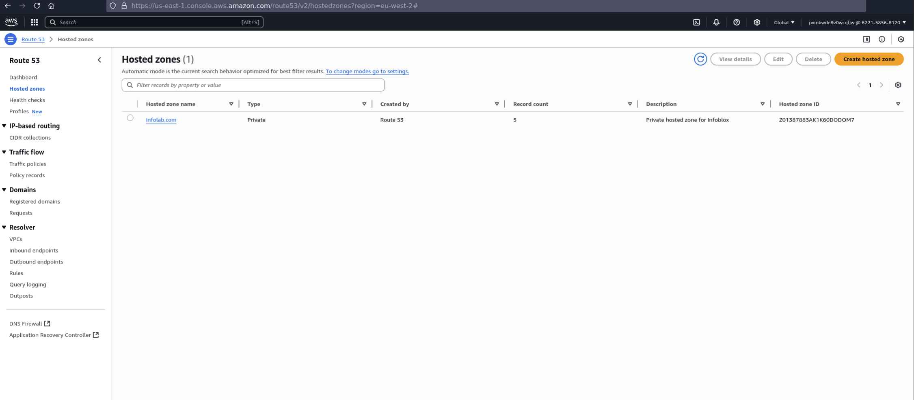


🏢 Step 3: Explore Azure DNS Zones

We switch to the Azure DNS view in Infoblox Portal  following: ** Configure →Networking →DNS → Zones**


Confirmed zone infolab.com exists and DNS records such as:

azure-webprodeu1.infolab.com → 10.10.1.100

azure-webprodeu2.infolab.com → 10.30.1.100

Confirm that these were pulled from Azure Private DNS that has been created.

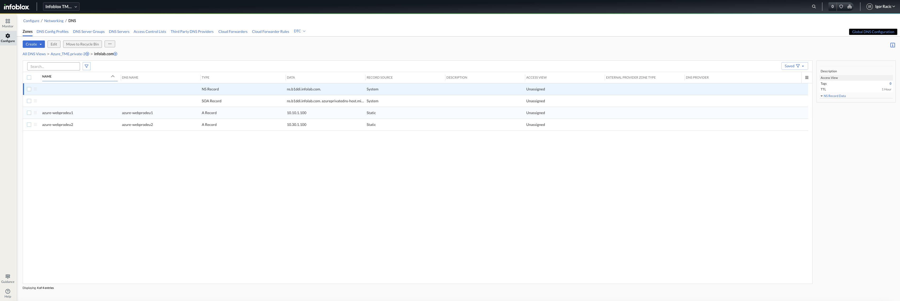


📊 Step 4: Inspect IPAM Data

In Infoblox Portal please Navigate to **Configure →Networking →IPAM/DHCP**  to ensure that cloud assests like VPCs, subnets, route tables etc from both AWS and Azure are discovered.


Validate the view - you have option to toggle FLAT option view as well on the right

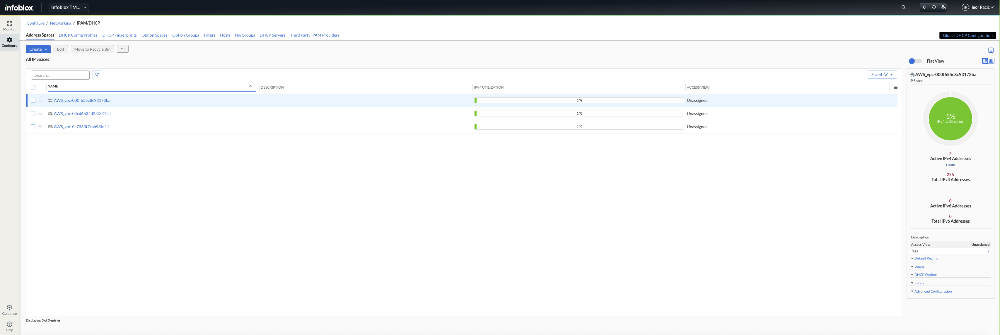

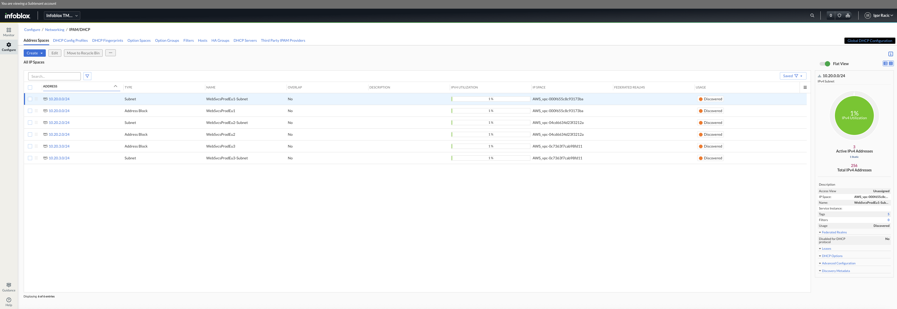

🖱️ You can click on any discovered item (such as IPs, subnets etc ) to drill down for more details like Attributes and Metadata of the assets:

Example shown in the screenshot below.


📈 Asset Visibility with UDDI – Unified View

With UDDI now actively syncing asset metadata across AWS and Azure, we can inspect what Infoblox surfaces as enriched visibility.

🔍 Step 1: Launch the Monitor Dashboard

In the Infoblox Cloud Console, on the left-hand menu:
Click Monitor


At the bottom of the screen, select the Assets tab.


This will present you with a visual dashboard of all discovered cloud assets.

🖱️ You can click on any chart or widget to drill down into more granular detail — for example:

	Asset classification (Zombie, Orphan, Ghost)
	Noncompliant assets (e.g., publicly exposed or unencrypted)
	DNS visibility (missing PTR/FWD records)
	IPAM coverage
	Asset location breakdown (CrowdStrike tags, regions)


	📊 What You’ll See
	•	Asset by Type – Server, Workstation, DNS, etc.
	•	Zombie/Orphan/Ghost breakdown
	•	Assets with Missing Records – great to see DNS hygiene issues
	•	Noncompliant Assets – Exposed or weak posture
	•	New Assets by Type – shows what was recently discovered
	•	Asset Locations – mapped by source tagging or EDR/CMDB sources


🧠 Pro Tip:
Click on any individual slice  — it’ll open up a filtered view of the exact assets impacted, letting you see more advanced details and troubleshoot DNS visibility, identify risky resources, or correlate cloud-native tags.


## Time for the Next Challenge

Click **NEXT**!


