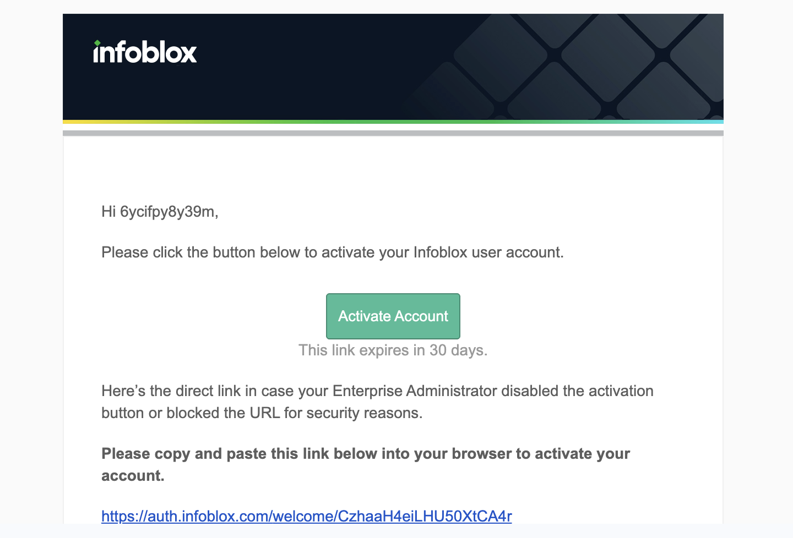
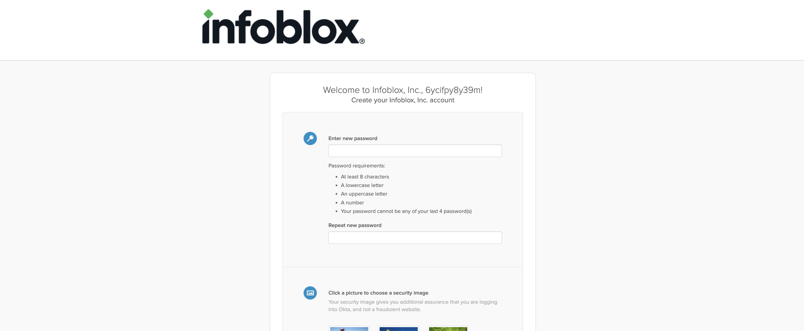
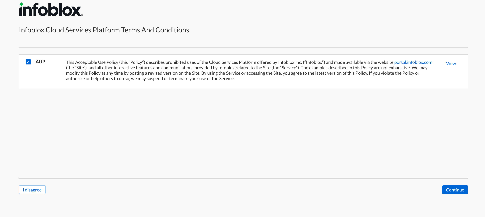
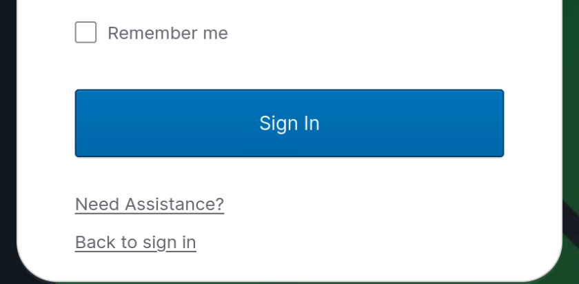
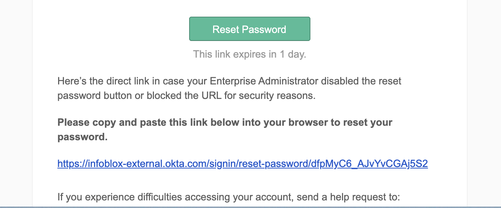

# Challenge 1: Review Architecture and Deploy Resources

In this lab, you will get hands-on with Infoblox Universal DNS Management, a single solution for
visibility and control of DNS tools used across on-premises, hybrid, and multi-cloud networks. You will
begin with a tour of the centralized visibility and management for DNS, exploring the efficiency of the
consolidated Infoblox Portal. Then, you'll manage DNS records in Azure DNS and AWS Route 53, using
the same Universal DDI interface and workflow to make updates across clouds.

> **IMPORTANT:** This environment is *real*! AWS and Azure Cloud Accounts have been created for each student. No bitcoin mining, please! :)

In this section we will:
1. Review the cloud architecture
2. Login to your cloud account consoles
3. Deploy resources onto your cloud regions
4. Create your Infoblox Portal user

---

## 1) Review Cloud Architecture

First lets review the cloud architecture that has been provisioned for your Infoblox Lab experience.

Open the lab architecture diagram and review it. This is what we're building today!

## 2) Login to your cloud account consoles

### AWS Console

1. Open the **AWS Console** VM in your CloudShare environment (click on the Windows VM thumbnail).
2. Select **IAM Account** (not root) on the login screen.
3. Enter the AWS credentials displayed on the CloudShare environment page.

> **Note:** Avoid the root account login — this lab is configured for IAM users only.

Your AWS credentials are available in the CloudShare environment details panel.

---

### Azure Console

1. Open a browser on the AWS Console VM (or your Ubuntu VM) and navigate to https://portal.azure.com
2. Use the Azure credentials provided in your CloudShare environment details.
3. Skip the Microsoft Onboarding Tour if prompted.
4. Once logged in, use the top search bar to navigate to:
   - Virtual Network
   - Private DNS Zones
   - Resource groups

Your Azure credentials are available in the CloudShare environment details panel.

---

## 3) Deploy resources onto your cloud regions

Now that you've logged into both cloud consoles, it's time to deploy the infrastructure that reflects the architecture shown in the lab diagram.

Switch to the **Ubuntu VM** terminal in your CloudShare environment.

### 1. Deploy AWS resources in EU

Core resources have already been provisioned using Terraform. You can verify:

- **AWS Console** – Navigate to EC2, VPC, TGW, etc. and confirm resources are in place.
- **Terraform Output** – Run:

```bash
cd ~/infoblox-lab/Infoblox-PoC/terraform
terraform output
```

Set up the DNS infrastructure:

```bash
cd ~/infoblox-lab/Infoblox-PoC/terraform
terraform apply --auto-approve -target=aws_route53_zone.private_zone -target=aws_route53_record.dns_records
```

### 2. Deploy Azure resources in North Europe

Azure resources have also been pre-deployed. Verify:

```bash
cd ~/infoblox-lab/Infoblox-PoC/terraform
terraform output
```

Set up Azure DNS infrastructure:

```bash
cd ~/infoblox-lab/Infoblox-PoC/terraform
terraform apply --auto-approve -target=azurerm_private_dns_zone.private_dns_azone -target=azurerm_private_dns_zone_virtual_network_link.eu_vnet_links -target=azurerm_private_dns_a_record.eu_dns_records
```

## 4) Create Admin User to your Infoblox Portal Dashboard

Your user account and sandbox tenant have already been created automatically when this environment started.

> **IMPORTANT:** If you've never accessed the Infoblox Portal before using the email address you used to start this lab, please follow the steps below to activate your account.

### Section 1 - Activate Your Account

1. Check the inbox of the email you used to register for the lab.
2. You will receive an email with subject **"Infoblox User Account Activation"**. Click **"Activate Account"**.



3. Create a new password when prompted.



4. Once password is set, open a browser and go to https://portal.infoblox.com/
5. Log in with your credentials.
6. After logging in, confirm access:



7. In the upper-left corner, click the drop-down menu. Use **"Find Account"** to search for your sandbox. Your Sandbox ID can be found on the Ubuntu VM:

```bash
cat /opt/cloudshare-lab/state/sandbox_id.txt
```


---

### Section 2 - Troubleshooting: Forgot Password

1. Go to https://portal.infoblox.com/
2. Click **"Need Assistance"** at the bottom of the login form.



3. Select **"Forgot Password"**.


4. Check your email for **"Account Password Reset"** and click **"Reset Password"**.



5. Set your new password, then return to Section 1, Step 4 above.

---

## Next Challenge

Now we've inspected the playing field, it's game time. Proceed to **[Challenge 2: Managing Public Cloud Providers](./02-managing-csps.md)**!
