# Challenge 2: Managing Public Cloud Providers

## Universal DDI Management - The Backbone of Modern Network Services

Universal DDI Management is the industry's first and most comprehensive SaaS-based solution for managing critical DNS, DHCP, and IPAM services across hybrid and multicloud environments.


### What It Does

- **Central Hub** - Single SaaS control plane for all network services across on-prem, AWS, Azure, GCP
- **Comprehensive Consolidation** - Unifies DNS, DHCP, and IP address management across Infoblox NIOS/NIOS-X, Amazon Route 53, Azure DNS, Google Cloud DNS
- **Streamlined Operation** - Eliminates silos and unifies policy across infrastructure

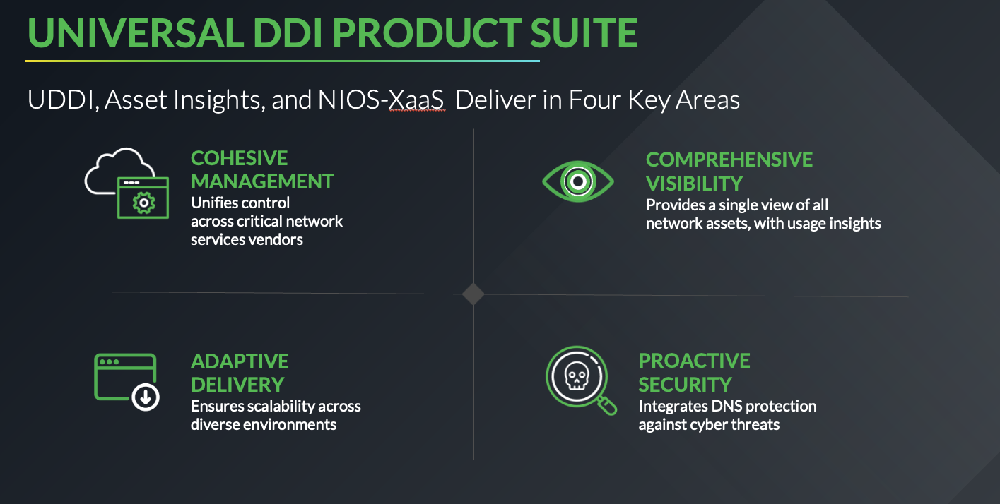

### Four Core Value Points

1. **Centralized Control** - Single interface for DNS/DHCP/IPAM across any environment
2. **Deep Integration** - Bridges traditional DNS with cloud-native platforms
3. **Operational Efficiency** - Reduces overhead, accelerates delivery
4. **Scalability and Flexibility** - Scales with your architecture

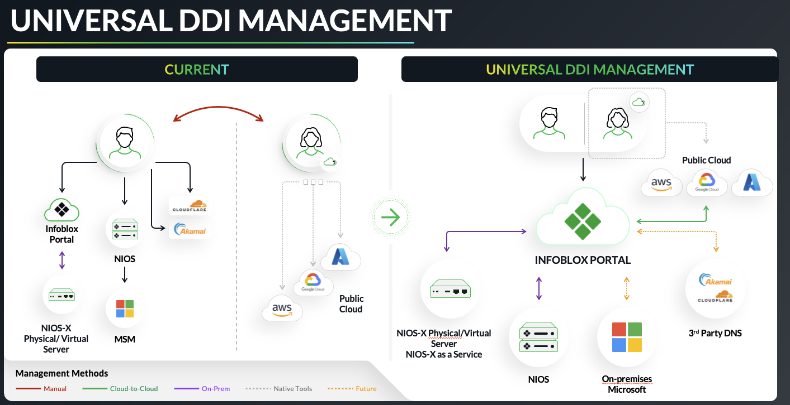

---

## 1) Login to your cloud account consoles

You should already be signed in to both AWS and Azure consoles. Only re-authenticate if your session has expired.

Your credentials are available in the CloudShare environment details panel.

---

## 2) Cloud Discovery Overview (AWS & Azure)

**Infoblox Universal Asset Insights** automatically discovers and tracks cloud resources using native cloud APIs.

### AWS Discovery

Infoblox connects to AWS via a cross-account IAM role using a secure External ID. Discovered resources include:
- EC2 instances, VPCs, subnets
- Route tables, NAT and Internet Gateways
- Load Balancers (ALB, NLB)
- Route 53 Hosted Zones and Records
- Tags, regions, and metadata

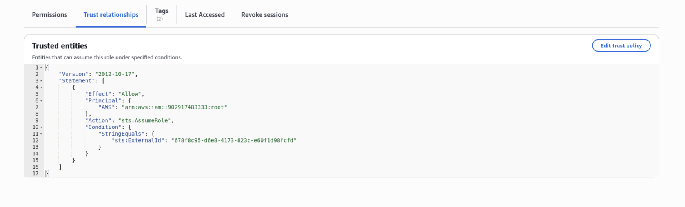
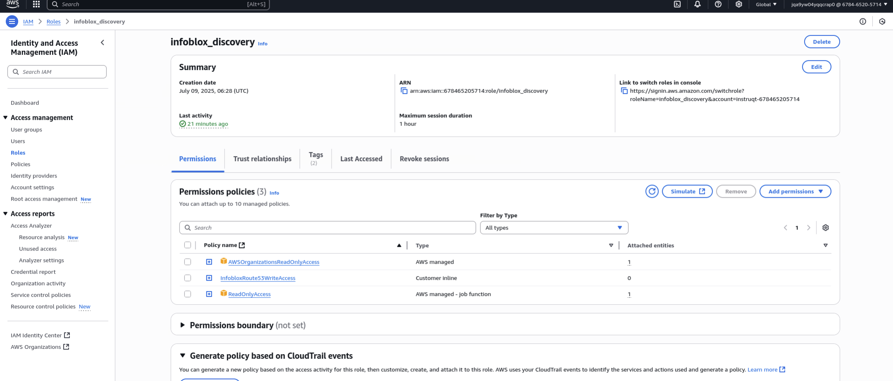

### Azure Discovery

Infoblox connects to Azure using a service principal with custom role assignment. Discovered resources include:
- Virtual Machines and NICs
- Virtual Networks, subnets, peerings
- Network Security Groups, DNS zones and records
- Resource groups, tags, and regional metadata

---

## 3) Onboarding AWS account onto Infoblox Portal

### Step 1: Retrieve Required Identifiers
You will need: Principal ID and External ID (from the Infoblox Portal).

### Step 2: Access the Infoblox Portal
Navigate to: **Configure → Networking → Discovery**

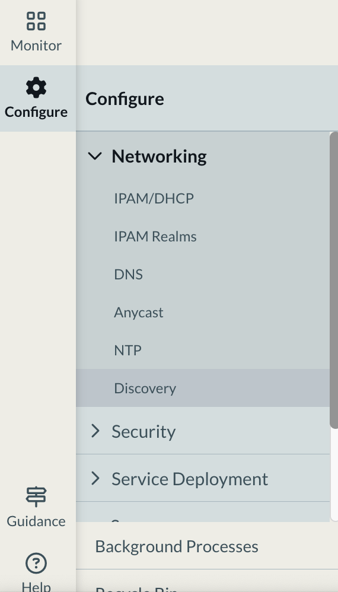

### Step 3: Configure AWS Discovery
1. Select the **Cloud** tab
2. Click **Create AWS**


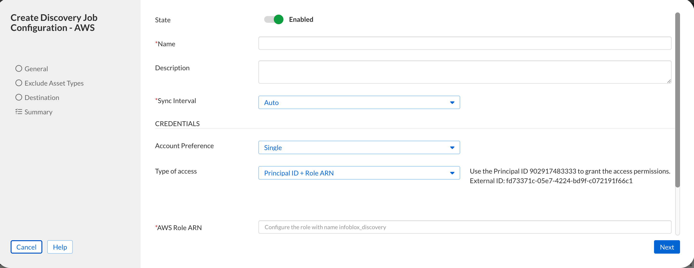

> **NOTE:** Gather External ID and Principal ID from the portal.

### Step 4: Deploy CloudFormation Stack

Open the AWS Console and navigate to CloudFormation. Create a new stack using the template URL from Infoblox.


### Step 5: Configure Stack Parameters

Provide a stack name and enter the External ID from the Infoblox Portal.

> **Note:** Leave the Account ID unchanged and COPY/PASTE External ID from the Infoblox Portal.

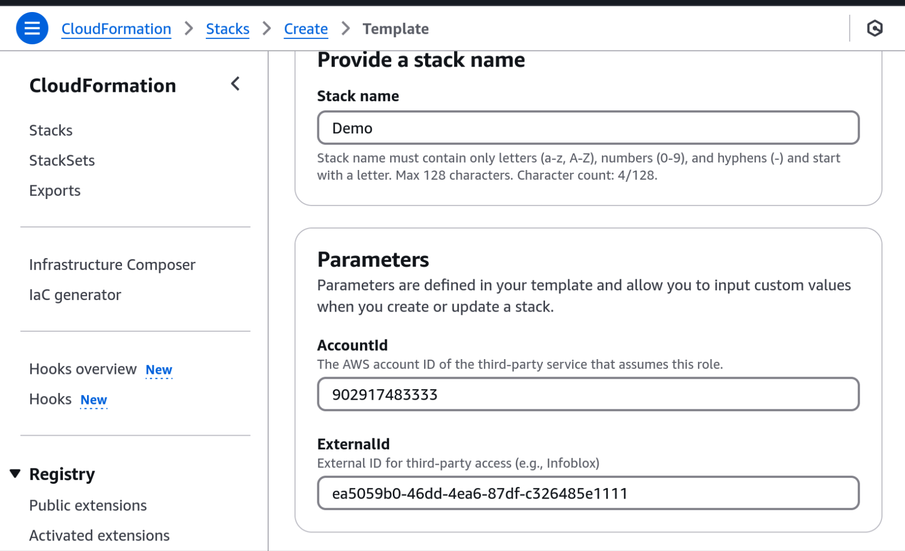

### Step 6: Click "Next" on each page, keeping defaults

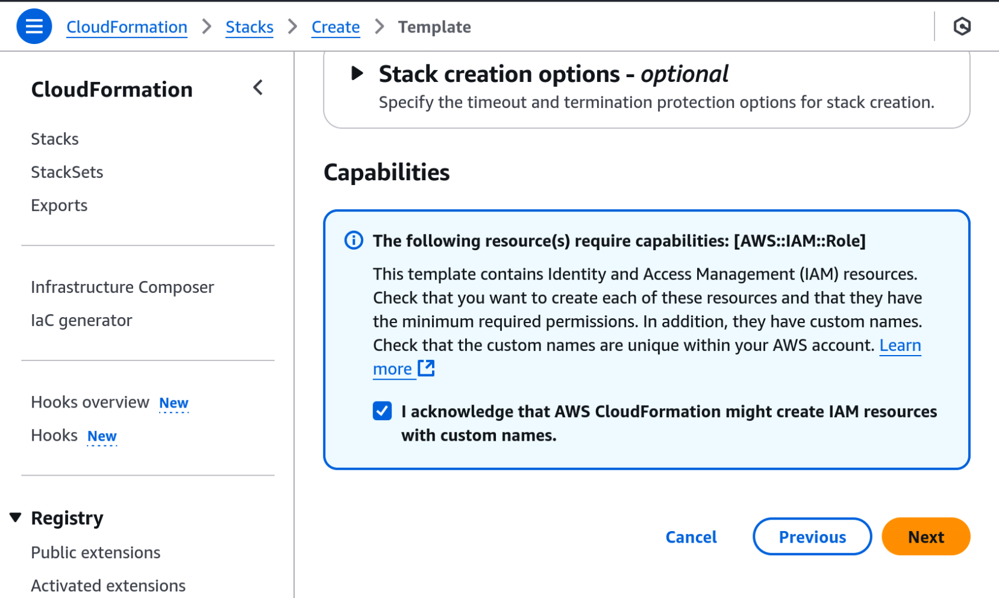

### Step 7: Click "Submit"


### Step 8: Get the ARN

Wait for completion, then go to **Outputs** tab to get the ARN value.


### Step 9: Paste ARN in Infoblox Portal

Return to the Infoblox Portal, paste the ARN, and click **Next**.

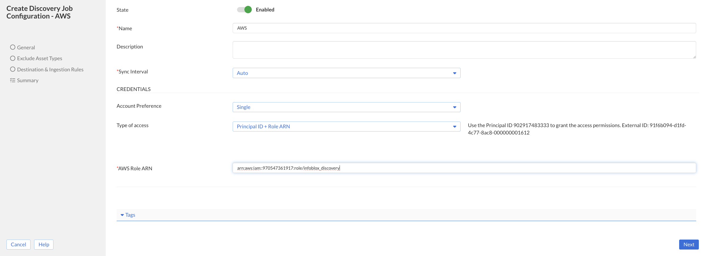

### Step 10-11: Configure sync settings

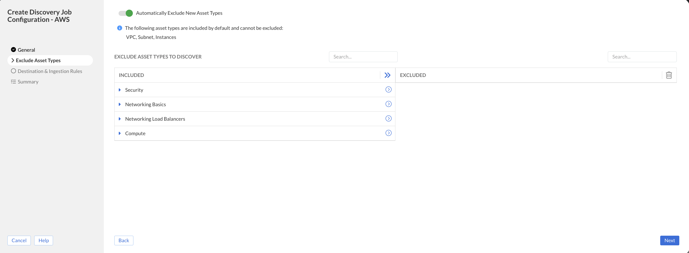
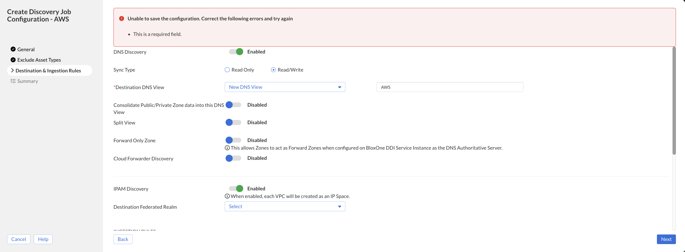


> **IMPORTANT:** The "Consolidate Public/Private Zone Data" toggle must remain **disabled** in this lab, since we are creating a new DNS View.

### Step 12: Save & Close

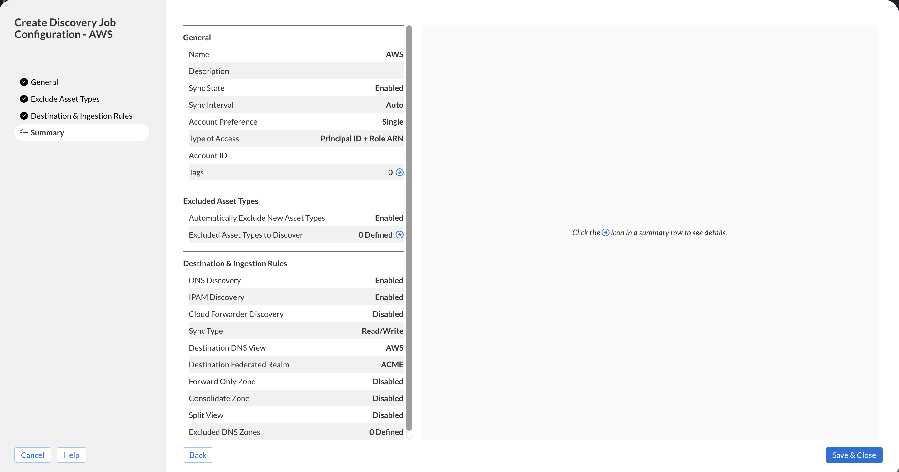

---

## 4) Onboarding Azure account onto Infoblox Portal

### Step 1: Create Azure Credentials
Navigate to: **Configure → Administration → Credentials**

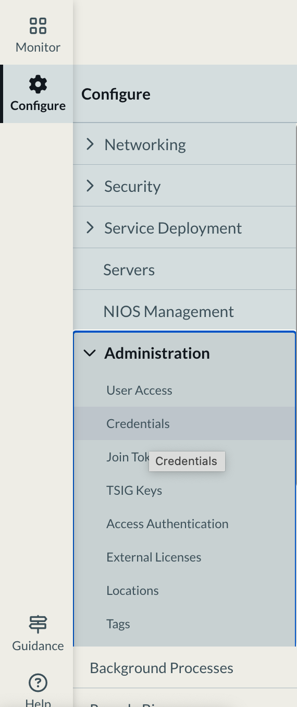

### Step 2: Click Create → Microsoft Azure


### Step 3: Fill in Azure credentials

Your Azure Tenant ID, Client ID, and Client Secret are available on the Ubuntu VM:

```bash
# These values are set during environment setup
# Check your environment details in CloudShare
```

> **IMPORTANT:** Don't forget to give it a Name at the top.

### Step 4-5: Configure Azure Discovery
Navigate to: **Configure → Networking → Discovery → Cloud → Create Azure**

### Step 6: Fill in Azure Subscription ID

```bash
# Available in your CloudShare environment details
```


> **IMPORTANT:** Select "Type of Access" → Static, then under "Credentials" select the one you created.

### Step 7-9: Configure sync settings


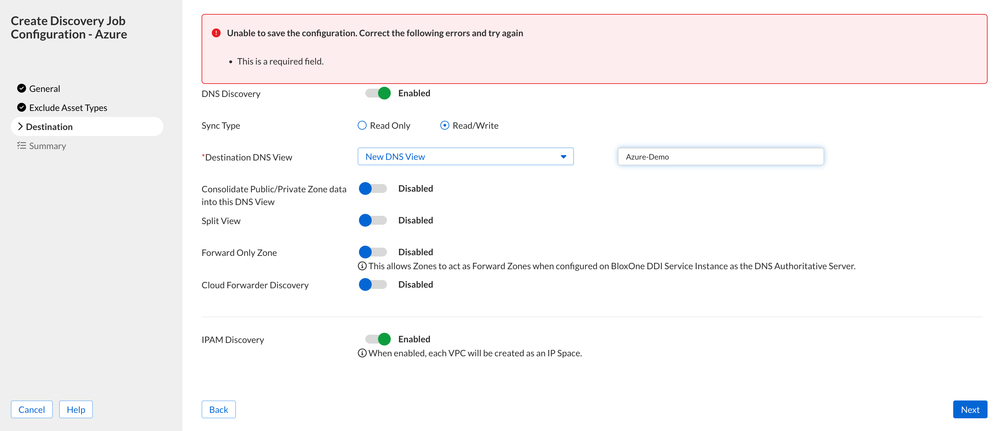
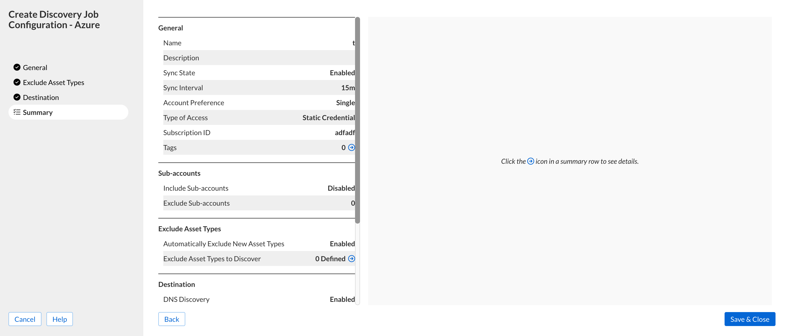

> **IMPORTANT:** Keep "Consolidate Public/Private Zone Data" **disabled** for this lab.

---

## 5) UDDI Explore and Visibility of Assets

### Step 1: Verify Discovery Sync

Navigate to **Configure → Networking → Discovery** and confirm both AWS and Azure jobs are **Synced**.

> **NOTE:** It will take around 2 × sync job interval (~15 mins each) for the Discovery jobs to sync.

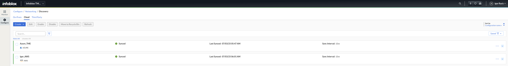

### Step 2: Explore AWS DNS Zones

Go to **Configure → Networking → DNS → Zones** and select the AWS DNS view:


Validate zone `infolab.com` with records:
- `app1.infolab.com` → `10.20.0.100`
- `app2.infolab.com` → `10.20.2.100`
- `app3.infolab.com` → `10.20.3.100`

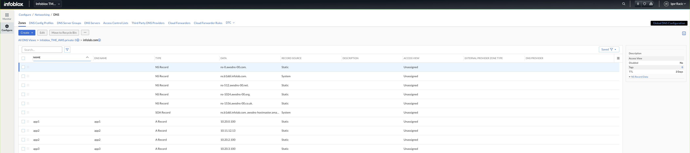

Add a new record: **Create → Record → A Record**
- `app4.infolab.com` → `10.10.10.9`

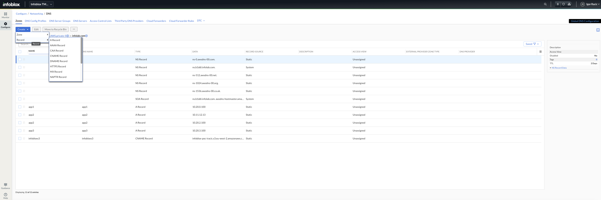
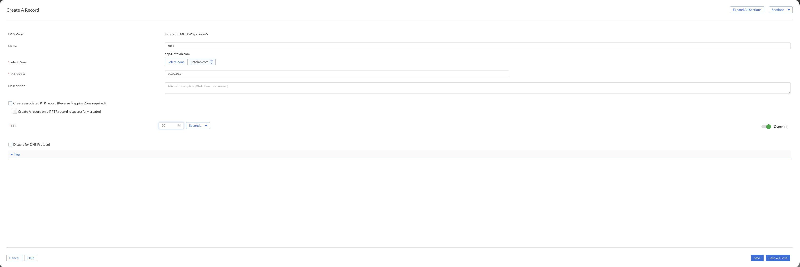

Switch to **AWS Console** → Route 53 → Hosted Zones → `infolab.com` and verify the new record synced.

> **IMPORTANT:** Make sure you are in the **EU-WEST-2** AWS Region (London).

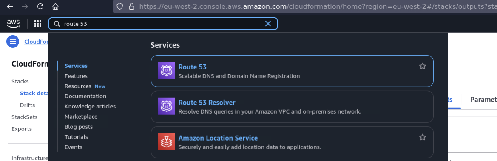

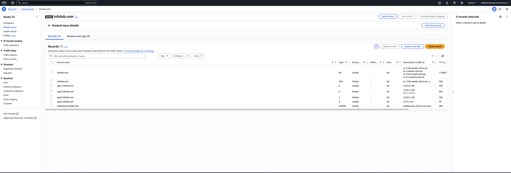

### Step 3: Explore Azure DNS Zones

Switch to the Azure DNS view: **Configure → Networking → DNS → Zones**

Validate zone `infolab.com` with:
- `azure-webprodeu1.infolab.com` → `10.10.1.100`
- `azure-webprodeu2.infolab.com` → `10.30.1.100`


### Step 4: Inspect IPAM Data

Navigate to **Configure → Networking → IPAM/DHCP** to see discovered cloud assets.

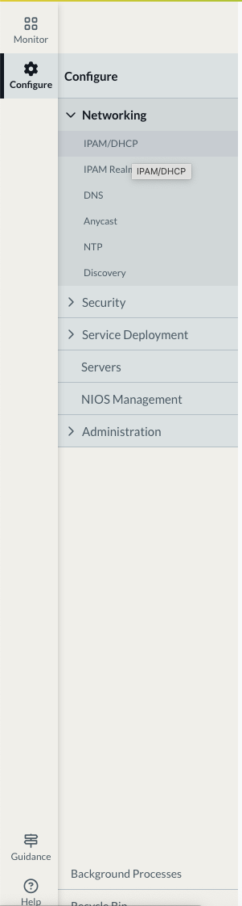


Click any item for details:

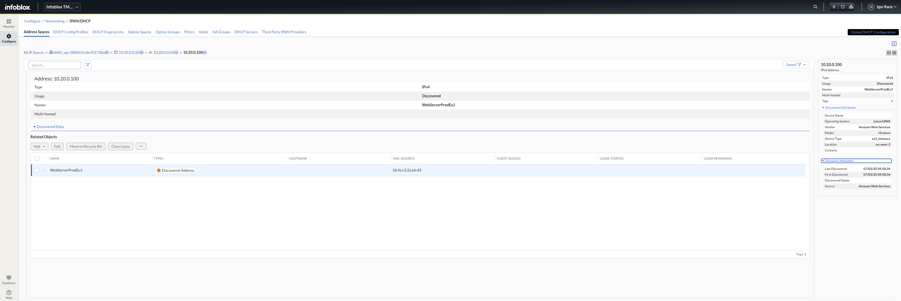

### Step 5: Asset Visibility Dashboard

Click **Monitor** in the left menu, then select the **Assets** tab.

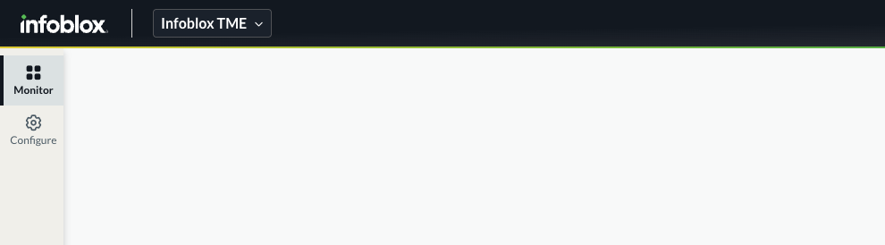
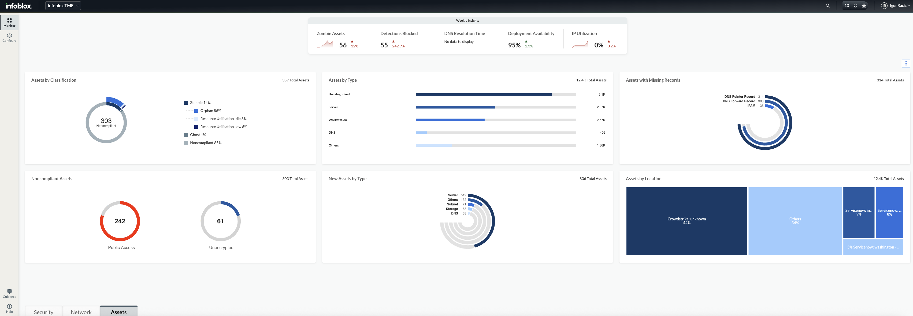
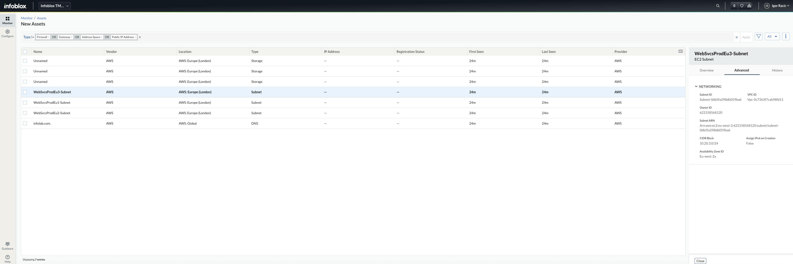

Explore:
- Asset by Type (Server, Workstation, DNS)
- Zombie/Orphan/Ghost breakdown
- Assets with Missing Records
- Noncompliant Assets
- New Assets by Type
- Asset Locations

> **Pro Tip:** Click on any chart slice to drill down into filtered views.

---

## Next Challenge

Proceed to **[Challenge 3: Quiz](./03-quiz.md)**!
